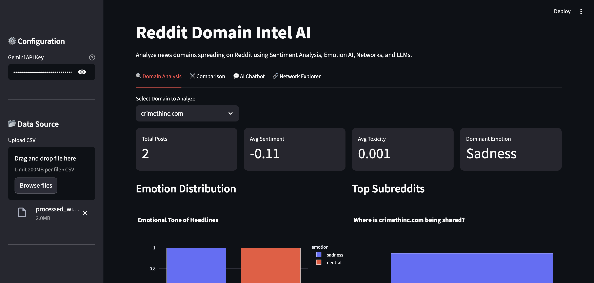
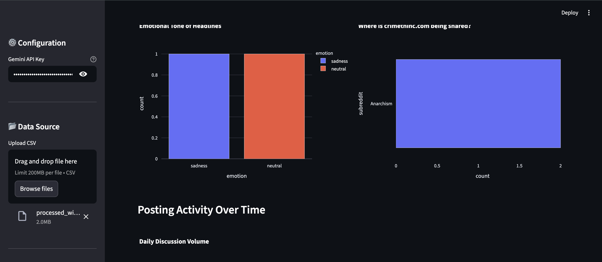
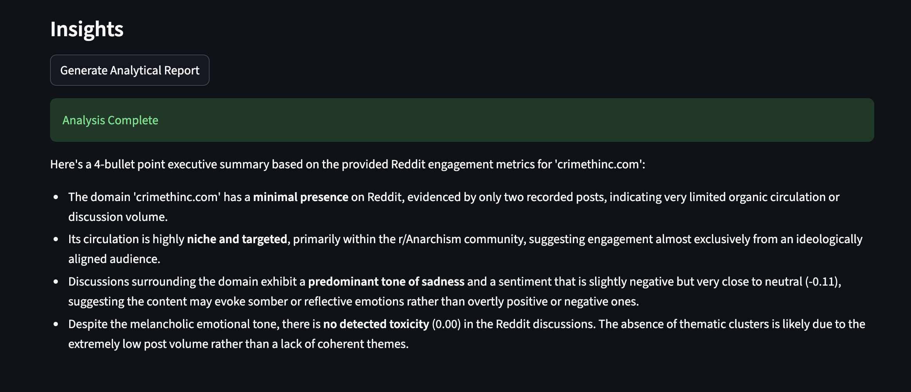
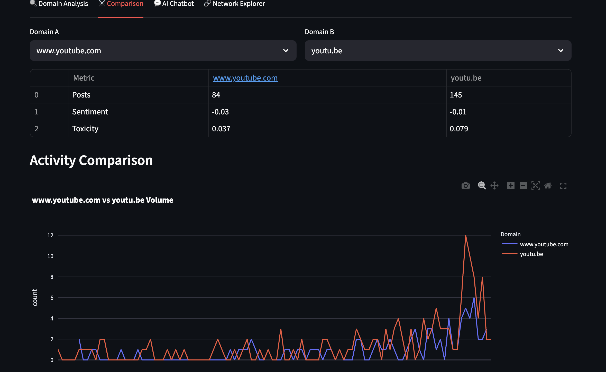

# Reddit Domain Intel AI – Link Spread Intelligence Dashboard

This project is my assignment submission for the **SimPPL Research Engineer Intern** position.

It is an investigative dashboard that analyzes how external news domains spread across Reddit.  
The tool is designed to help researchers understand:

- **Which communities amplify a given domain**
- **How discussion volume evolves over time**
- **What tone (sentiment, emotion, toxicity) the posts carry**
- **What topics / narratives those posts cluster into**
- **How communities, topics, emotions, and domains connect in a network**

The dashboard is built in **Streamlit**, uses several **NLP / ML models**, and is **hosted publicly**.

---

## 🔗 Live Demo & Video

- **Hosted App:** `https://reddit-analyis10.streamlit.app/`
- **Demo Video (Drive):** `https://drive.google.com/file/d/1dbSiT_vcggoMXH2FjqzIls7_cihKnVQM/view?usp=sharing`

---

## 📁 Dataset

The app expects a CSV file (e.g. `processed_with_ai.csv`) where each row corresponds to a single Reddit post.

Minimum useful columns:

| Column        | Required | Description                                               | Example                          |
|---------------|----------|-----------------------------------------------------------|----------------------------------|
| `title`       | ✅       | Post title / headline                                    | `"Wikipedia bans 100% of..."`   |
| `domain`      | ✅       | External link domain                                     | `"youtube.com"`, `"cnn.com"`    |
| `subreddit`   | ✅       | Subreddit where it was posted                            | `"Anarchism"`, `"Conservative"` |
| `created_utc` | ✅ (for time series) | Timestamp of post (will be parsed to datetime) | `"2025-02-01 15:39:27"`         |

Optional precomputed columns (if present they’ll be used; if not, the app can compute them):

- `sentiment` – numeric score (VADER compound)
- `toxicity` – numeric score (0–1)
- `emotion` – categorical label like `joy`, `anger`, `sadness`, `neutral`

---

##  Features & Walkthrough

The interface has **four main tabs** plus a configuration sidebar.

###  Sidebar: Configuration & Data

- **Gemini API Key** – used for:
  - Domain-level analytical reports
  - RAG chatbot answers
- **Upload CSV** – upload your processed Reddit data  
  Once uploaded, the app:
  - Parses `created_utc` as datetime
  - Fills in missing NLP columns if needed (sentiment, toxicity, emotion)

---

### 1.  Domain Analysis

This tab answers:  
> *“How is this domain being talked about across Reddit?”*

You select a domain from a dropdown (e.g. `crimethinc.com`, `youtube.com`).  
The tab shows:

#### Summary Cards

- **Total Posts** – how many posts mention this domain
- **Avg Sentiment** – mean VADER compound score
- **Avg Toxicity** – mean toxicity score from a transformer classifier
- **Dominant Emotion** – most frequent emotion label

#### Emotion Distribution

A bar chart of the **emotional tone of headlines** for that domain.

#### Top Subreddits

A horizontal bar chart of **subreddits that share the domain most**, acting as a proxy for key amplifying communities.

#### Posting Activity Over Time

A line chart of daily post counts for the domain, showing when attention spikes or fades.

#### AI Analytical Report (Gemini)

A button `"Generate Analytical Report"` sends an aggregated prompt to **Google Gemini**.  
It returns a short, 4-bullet **executive summary**, for example:

- Overall presence and volume  
- Niche vs mainstream spread  
- Tone (sentiment, emotion, toxicity)  
- High-level narrative interpretation

This is aimed at **non-technical audiences**.

---

### 2.  Comparison

This tab lets you compare **two domains side by side** (e.g. `www.youtube.com` vs `youtu.be`).

- A comparison table shows:
  - Number of posts
  - Average sentiment
  - Average toxicity
- A combined **Activity Comparison** line chart shows their volumes over time on the same axis, highlighting:
  - Which one spikes more
  - Differences in attention patterns

---

### 3.  AI Chatbot (RAG)

This tab lets you **chat with the dataset**.

Under the hood:

1. For a chosen domain, the app:
   - Embeds all its titles using **SentenceTransformer** (`all-MiniLM-L6-v2`)
   - Indexes them in a **FAISS** vector store
2. When you ask a question (e.g.  
   *“What does the dataset suggest about the emotional and political context around this domain?”*):
   - It retrieves the **top-k similar posts**
   - Computes aggregate signals (sentiment, toxicity, dominant emotion, most active subreddit, topic cluster)
   - Sends a structured prompt + signals to **Gemini**
3. Gemini responds with an **analytical paragraph** and a follow-up question, plus:
   - A shortlist of **Top Relevant Posts** for transparency

This satisfies the rubric’s requirement for:

- **Chatbot querying of trends, themes, and narratives**
- **Semantic / embedding-based retrieval beyond keyword search**

---

### 4. Network Explorer

This tab builds **network graphs** to explore how communities and narratives connect.

Network types:

1. **Subreddit ↔ Narrative Cluster (per selected domain)**
   - KMeans clustering over titles → “topic clusters”
   - Shows which subreddits are strongly connected to which clusters

2. **Subreddit ↔ Emotion (per selected domain)**
   - Connects subreddits to their dominant emotions around the domain

3. **Domain ↔ Subreddit (Global)**
   - Across the whole dataset, shows which domains are central for which communities

Technical details:

- Graphs are built with **networkx**
- Layout and visuals rendered with **Plotly**
- Nodes:
  - Blue = subreddits
  - Orange = topic clusters
  - Green = emotions
  - Red = domains
- Node size scales with **number of posts**
- Edge thickness corresponds to **relationship strength** (post count)

#### Node & Edge Summaries

Below the graph:

- **Node Summary** – table showing node, type, total posts, cluster id, emotion
- **Edge Summary** – table of source, target, and count

#### Drill Down into a Node

You can select any node (e.g. `Cluster 0` or `Anarchism`) and see **up to 50 posts** associated with it, including:

- `created_utc`
- `subreddit`
- `domain`
- `emotion`
- `title`

This supports qualitative inspection of the narratives behind each structural pattern.

---

##  Models & Libraries

**Frontend / App**

- `streamlit`
- `plotly` for charts
- `pandas`, `numpy` for data handling

**NLP / ML**

- `vaderSentiment` – sentiment analysis
- `transformers` pipelines:
  - `unitary/toxic-bert` – toxicity classification
  - `j-hartmann/emotion-english-distilroberta-base` – emotion classification
- `sentence-transformers` – semantic embeddings for RAG
- `scikit-learn` – `TfidfVectorizer`, `KMeans` clustering
- `faiss` – vector similarity search
- `networkx` – network construction

---

##  Design & Thought Process

The system is structured to align with the SimPPL rubric:

1. **Summary statistics & time series**  
   Metrics + daily volume charts per domain.

2. **Communities & key contributors**  
   Top subreddits + domain–subreddit and subreddit–cluster networks.

3. **AI / ML enrichment**  
   Multiple models for sentiment, toxicity, emotion, and clustering.

4. **Interactive & multimodal querying**  
   - Domain-level drilling
   - Cross-domain comparisons
   - RAG chatbot for qualitative questions
   - Network visualizations for structure

5. **Explainable outputs**  
   - Tables and charts
   - Node/edge summaries
   - LLM-generated reports with retrieved titles shown explicitly

---


##  Screenshots

Below are key views of the platform demonstrating core functionality.

---

### 🧭 1. Configuration & Data Loading

This screen shows where the user enters their **Gemini API key** and uploads the CSV dataset.  
This is intentionally not hardcoded, so users can analyze **any dataset** without modifying the source code.



---

### 🔍 2. Domain Analysis Overview

Displays total posts, average sentiment, toxicity, dominant emotions, subreddit distribution, and time-series posting patterns for the selected domain.



---

### 🤖 3. AI Summary Generation

Shows the LLM-powered insight generation feature where Gemini produces a high-level narrative summary of how a domain spreads and what tone surrounds it.



---

### ⚔️ 4. Domain Comparison View

Allows side-by-side comparison of two domains (ex: `youtu.be` vs `youtube.com`) including sentiment, toxicity, and posting activity trends.



---


##  Running Locally

1. **Clone your fork (see instructions below in the assignment guidelines).**
2. Install dependencies:

   ```bash
   pip install -r requirements.txt


